# Overview: The notebook:open_book: of junior software engineer:keyboard:

This notebook is and will be with me in the path of a software engineer working on 3D stuffs. This notebook and is constantly evolving.

The topic ranges from programming language like C#, C++, Python, to 3D Software I mostly use like Rhino, Blender, and even to some Algorithm.

# Table of Content

- [Overview](#overview-the-notebookopen_book-of-junior-software-engineerkeyboard)
- [Table of Contents](#table-of-content)
- [1.Computer System](#1computer-systemdesktop_computer)
  - [Git](#git%EF%B8%8F)
  - [Shell](#shellshell)
- [2.Programming Language][#2programming-languagespeaking_head]
  - [C#](#c)
  - [C++](#c-1)
- [3.IDE & Text Editor][#3ide--text-editor-memocomputer]
  - [Visual Studio IDE](#visual-studio-ide)
  - [Visual Studio Code](#visual-studio-code)
- [4.Devops][#4devops]
  - [Documentation Tool](#documentation-toolbooks)
  - [Docker][#docker]
- [5.Geometry Kernel][#5geometry-kerneltriangular_ruler]
  - [RhinoCommon & Grasshopper](#rhinocommongrasshopperrhinoceros)
- [6.Algorithm](#6algorithm)
- [7.Robotics](#7robotics)

# 1.Computer System:desktop_computer:

## Git🕷️

### 1.删除branch locally and remotely

del local branch:    `git branch -d {the_local_branch}`

del remote branch:	`git push origin --delete {the_remote_branch}`

### 2.如何删除你现在做的任何东西回到某一次commit?

```bash
# This will destroy any local modifications.
# Don't do it if you have uncommitted work you want to keep.
git reset --hard 0d1d7fc32
```

`0d1d7fc32`是你的git id

### 3.Software for Git

`SourceTree` is a free software managing Git while it provides GUI to interact with Git. Highly recommend! You can download:

https://www.sourcetreeapp.com/

## Shell:shell:

### 1.`.\xxx`是什么意思？

假设我们在`win`运行`dir`(≈Unix的`ls`)，看到如下列表

```bash
2021/07/28  10:20    <DIR>          .
2021/07/28  10:20    <DIR>          ..
2021/07/28  09:41               141 .gitattributes
2021/07/28  09:41    <DIR>          .github
2021/07/28  09:41             5,559 .gitignore
2021/07/28  09:41                 0 .vcpkg-root
2021/07/28  09:41               100 bootstrap-vcpkg.bat
2021/07/28  09:41               109 bootstrap-vcpkg.sh
2021/07/28  10:06    <DIR>          buildtrees
2021/07/28  09:41         1,210,046 CHANGELOG.md
2021/07/28  10:21                93 CMakeDirectory.txt
2021/07/28  09:41             2,432 CONTRIBUTING.md
2021/07/28  09:41    <DIR>          docs
2021/07/28  10:06    <DIR>          downloads
2021/07/28  09:58    <DIR>          installed
2021/07/28  09:41             1,096 LICENSE.txt
2021/07/28  09:41             2,334 NOTICE.txt
2021/07/28  10:06    <DIR>          packages
2021/07/28  09:41    <DIR>          ports
2021/07/28  09:41            12,381 README.md
2021/07/28  09:41            15,908 README_es.md
2021/07/28  09:41            12,459 README_fr.md
2021/07/28  09:41            13,961 README_ko_KR.md
2021/07/28  09:41            11,716 README_zh_CN.md
2021/07/28  09:41    <DIR>          scripts
2021/07/28  09:41               923 shell.nix
2021/07/28  09:41    <DIR>          toolsrc
2021/07/28  09:41    <DIR>          triplets
2021/07/28  09:44         3,359,624 vcpkg.exe
2021/07/28  09:41    <DIR>          versions
```

也就是

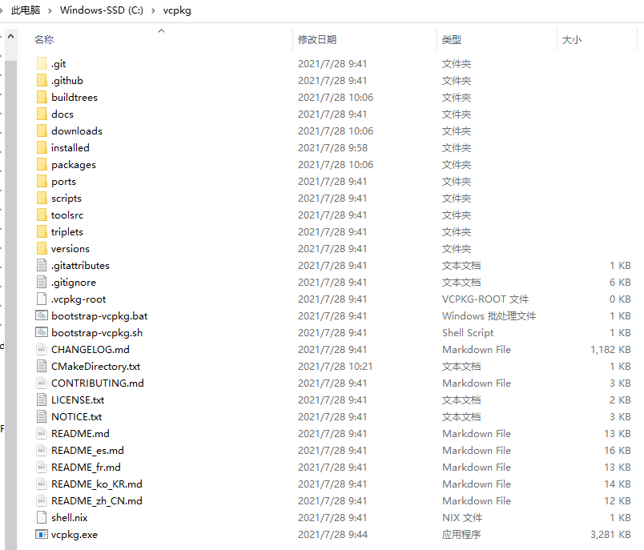

因此

```bash
.\vcpkg 
```

就是运行当前目录下的`vcpkg.exe`，如果后面有参数

```bash
.\vcpkg search libigl
```

​	那就是说明它在build这个`vcpkg.exe.`的时候预留了给你输入参数的代码。

To conclude, `.\`就是运行当前目录下的某个文件


# 2.Programming Language:speaking_head:

## C#

### 1.如何像Python一样创建一个List of Booleans in C#

```c#
using System.Linq;

List<double> Z;
var allFalse = Enumerable.Repeat(false, Z.Count);
```

### 2.out如何使用？

```c#
public static void Run(out List<Plane> planes, out List<string> commands)
{
    //用out的话，一定要在最前面赋值！！
    planes = new List<Plane>();
    commands = new List<string>();
    //然后对这些List进行操作
    planes.Add(Plane.WorldXY);
    planes.Add(Plane.WorldYZ);
    planes.Add(Plane.WorldZX);
    commands.Add("Hello!");
    commands.Add("My name is John!");
}
```

在调用的时候是这样：

```c#
List<Plane> ps = new List<Plane>();
List<string> ss = new List<string>();
Run(out ps, out ss);
```

### 3.接口与实例化

例如我定义了

```c#
interface IParam
{
    Vector3d WorldX { get; }
}
```

然后我也显示实现了WorldX

```c#
public class Param : IParam
{
    Vector3d IParam.WorldX
    {
        get => new Vector3d(1, 0, 0);
    }
}
```

:x: 但是为什么我无法调用World?如下

```c#
Vector3d IParam.SafeShift
{
    get => IParam.WorldX * 2.5;
}
```

仔细想想，`IParam`是什么？它是接口，接口怎么会有instance(实例化)？！？对吧？理解这个东西之后，我们需要把`IParam`显示指定实例化`this`，这样：

```c#
Vector3d IParam.SafeShift
{
    get => ((IParam)this).WorldX * 2.5;
}
```

### 4.显示实现interface和隐式实现interface的区别

首先我定义了接口

```c#
interface IParam
{
    double X { get; }
    double Y { get; }
}
```

#### 4.1显示实现explicitly

我显示实现(explicitly)：

```c#
public class ParamP : IParam
{
    double IParam.X { get => 1; }
    double IParam.Y { get => 2; }
}

public class ParamZ : IParam
{
    double IParam.X { get => 10; }
    double IParam.Y { get => 20; }
}
```

那么我在用的时候，需要这样：

```c#
IParam pp = new ParamP() as IParam;
IParam pz = new ParamZ() as IParam;
```

或者这样：

```c#
ParamP pp = new ParamP();
ParamZ pz = new ParamZ();
IParam p;
p = flag ? pp as IParam : pz as IParam;
```

#### 4.2隐式实现implicitly

我隐式实现：

```c#
public class ParamP : IParam
{
    public double X { get => 1; }
    public double Y { get => 2; }
}

public class ParamZ : IParam
{
    public double X { get => 10; }
    public double Y { get => 20; }
}
```

那我就可以直接用了：

```c#
ParamP pp = new ParamP();
ParamZ pz = new ParamZ();
```

为什么这么设计呢？

你可以想象interface前面都是virtual，如果你不public，怎么override它呢？

### 5.Linq Select没有返回值的item

假设你有`List<Curve> crvs`，你想对它们整体偏移。那么你可能会：

```c#
using System.Linq;
var shiftCrvs = crvs.Select(crv => crv.Translate(100, 0, 0)).ToList();
```

但是实际上你可能得到的是一系列`boolean`， 因为

```c#
public bool Translate(
	double x,
	double y,
	double z
)
```

因此应该怎么做呢？

```c#
var shiftCrvs = crvs.Select(crv => {crv.Translate(100,0,0); return crv;}).ToList();
```

过程其实一目了然，

1.先选择`crv`为crvs里的每一row，

2.然后`{}`是对`crv`的操作。

3.该操作是，先`Translate`，然后`return`该已经位移的crv


## C++

### 1.C4996, `fopen`: This function or variable may be unsafe.

当你用Visual Studio IDE去编译C++的时候，经常会遇到

``` bash
'fopen': This function or variable may be unsafe. 
'fscanf': This function or variable may be unsafe. 
```

:heavy_check_mark: 解决方案是：

Select your project and click `Properties` in the context menu.

In the dialog, chose `Configuration Properties` -> `C/C++` -> `Preprocessor`

In the field `PreprocessorDefinitions` add `;_CRT_SECURE_NO_WARNINGS` to turn those warnings off.

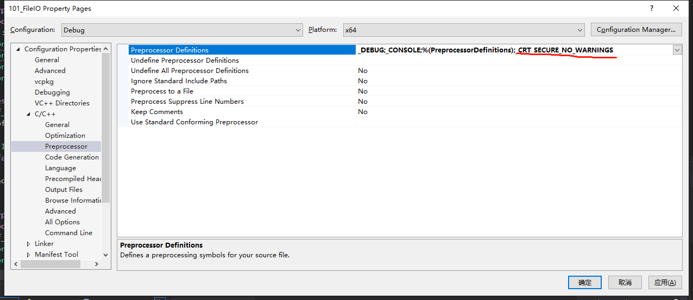

然后，

`Configuration Properties` > `C/C++` > `Advanced` property page.

Edit the `Disable Specific Warnings property` to add *`4996`*

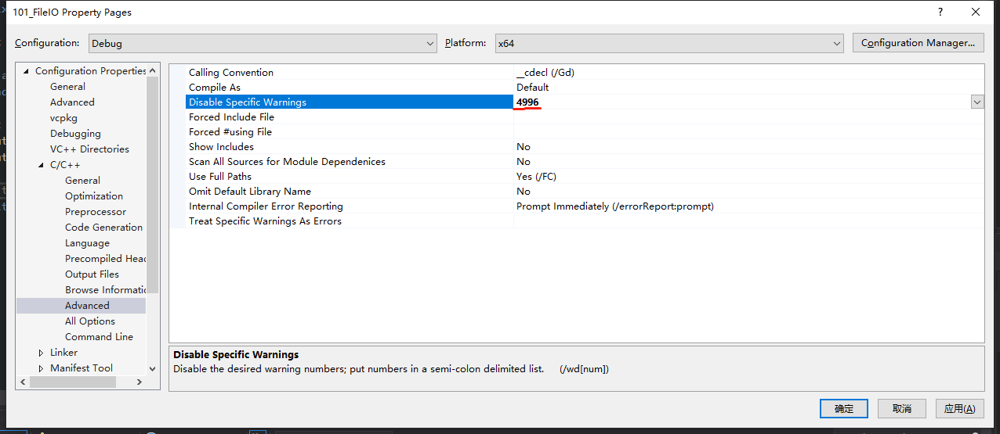

:warning: 需要注意的是，上面更改Properties的地方是`x64`，但是你Build的时候有可能是`x86`！！！因此，最好properties两个platform都改。

### 2.C2440, cannot convert from `char *` to `LPWSTR`

`Project`=>`Properties`=>`Configuration Properties`=>`Advanced`=>`Character Set`=>`Use Multi-Byte Character Set`:heavy_check_mark:

### 3.E0135 namespace "std" has no member "filesystem"

Because `std::filesystem` is a feature of C++17.

`Project`=>`Properties`=>`Configuration Properties`=>`C/C++`=>`Language`=>`C++ Language Standard`=>`ISO C++17 Standard (/std:c++17)`:heavy_check_mark:

### 4.How do you know Project Property Inheritance?

On a property page, a property in **bold** is defined in the current context. A property in normal font is inherited.

e.g. The following **bold** label like `C++ Language Standard` is defined by myself.

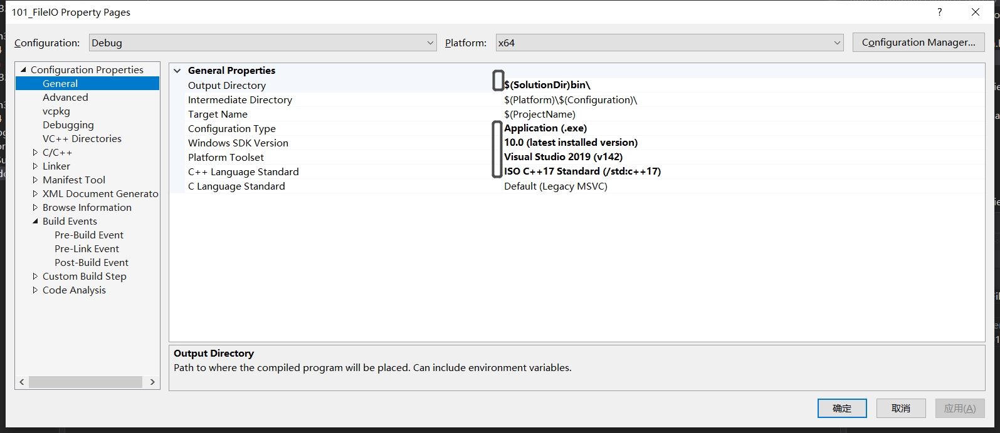

### 5.Use `Property Manager` to apply your setting across different projects

If you are tired of setting `Property` manually in VS IDE, you can set up a property sheet(*.props*) to apply the setting.

**View** > **Property Manager** or **View** > **Other Windows** > **Property Manager**


## Python


# 3.IDE & Text Editor :memo::computer:


## Visual Studio IDE

### 1.IDE或者Editor的行数和光标信息

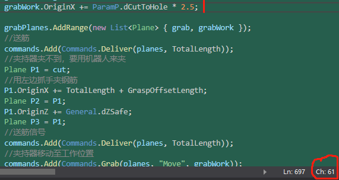

如上图所示，我光标在`2.5;`后面，这里显示`Ln: 697    Ch: 61`代表第697行，第61个字符的位置

### 2.如何更改Build的output folder？

在C#里，可以在`Properties`的**Build** tab修改，那C++呢？在 **General** tab.

### 3.Bookmarks

`Ctrl`+`K,K`,double click K. Then the bookmark will be opened.

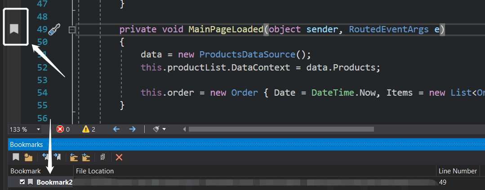

### 4.Code snippets

I think this can be very handy! `Code snippets` is sort of `alias` of the code. Similar to the alias of Grasshopper component. So, how to invoke code snippets?

`Ctrl`+`K`,`B` open the Code Snippets Manager. You can find all the code snippets here!! For example, if you left

```c#
tryf
```

in the code editor, the cursor is right after `tryf`, you **double tab**!!  IDE would generate the following code for you.

```c#
try 
{	        

}
finally
{

}
```

### 5.Cycle through the files you opened with keyboard

`Ctrl`+`Tab`  You can loop over the files you opened.

`Ctrl`+`Shift`+`Tab` You can loop over the files you open reversely.

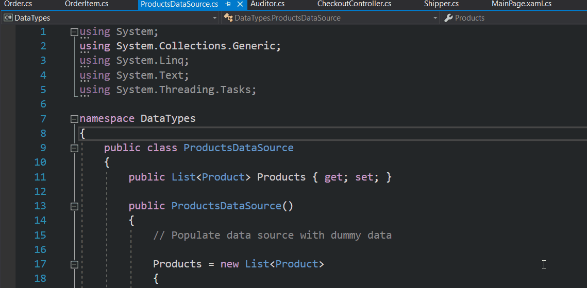

### 6.Close all the tabs

Managing many opening tabs is bit distraction for me. Sometimes I want to close all the tabs by:

`Alt`+`W,L`

### 7.Find the file and method you need:star:

This is very handy!! When I was working, I only left one file opened. And the fastest way to find the method in which file is to 

`Ctrl`+`,`        It will navigate you to the where the code is exactly!!


See above animation, I don't have any files opened until I press `Ctrl`+`,` and navigate to where I am interested it.

### 8.Full screen mode

`Shift`+`Alt`+`Enter`    You can access/quit full screen mode by this shortcut.

### 9.Collapse block of code

`Ctrl`+`M,M`

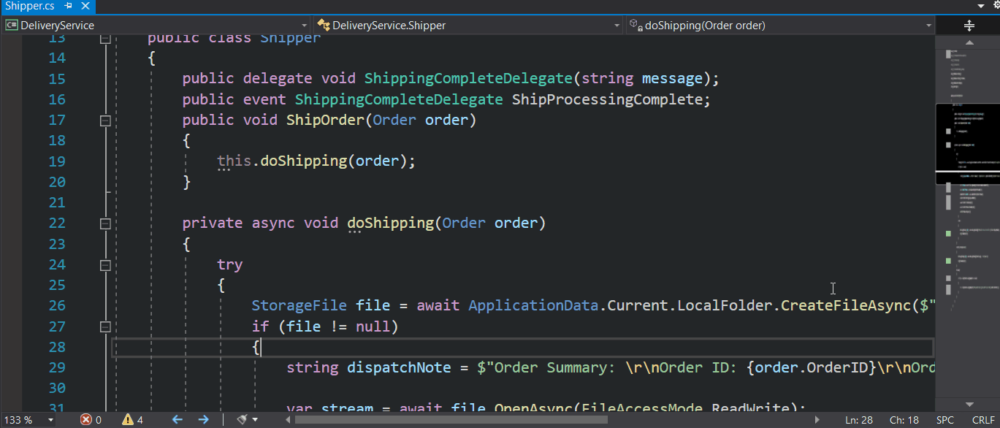


## Visual Studio Code


# 4.Devops

## Documentation Tool:books:

### 1.如何设置docfx的template？

普通：

```json
{
  ...
  {
    "build" :
    {
      ...
      "template": "custom",
      ...
    }
  ...
}
```

带文件路径的：

```json
{
  ...
  {
    "build" :
    {
      ...
      "template": ["default", "X:/template/custom"],
      ...
    }
  ...
}
```


## Docker

# 5.Geometry Kernel:triangular_ruler:

## RhinoCommon&Grasshopper:rhinoceros:🦗

### 1.Point3d和Plane

它们都是struct，因此是value type，所以不用Duplicate或者Clone，当它们是double那种值类型就好了。a.k.a. RhinoCommon的doc里面写着`structure`的，都是struct!!

```c#
Point3d pt1 = new Point3d(0, 0, 0);
Point3d pt2 = new Point3d(1, 0, 0);
pt2 = pt1;
pt1.X = 10;
pt2.Transform(Transform.Translation(new Vector3d(100, 0, 0)));

A = pt1;
B = pt2;
```

因为是值类型，那么可以想象得到，A是{10, 0, 0}，B是{100, 0, 0}。

### 2.如何在`SolveInstance`外调用RuntimeMessage

之前我加RuntimeMessage都是这样，在

```c#
protected override void SolveInstance(IGH_DataAccess DA)
{
    AddRuntimeMessage(GH_RuntimeMessageLevel.Warning, "Warning!");
}
```

但如果我写了一个Class, 那个class里面有方法想要AddRuntimeMessage怎么办？？

可以这样写那个Class

```c#
public class ClassName
{
    public ClassName()
    {
        
    }
    public void Run(GH_ActiveObject obj, ref List<Plane> planes, ref List<string> commands)
    {

        obj.AddRuntimeMessage(GH_RuntimeMessageLevel.Warning, "xxx");
    }
}
```

那到时候在SolveInstance就可以

```c#
protected override void SolveInstance(IGH_DataAccess DA)
{
    var instance = new ClassName();
    instance.Run(this, planes, commands);
}
```

:question:为啥要用`this`? 其实`AddRuntimeMessage`是该类的方法，因此`obj`代指当前的实例，然后在SolveInstance那里，我会把this是当前实例

### 3. Grasshopper的RuntimeError

```C#
AddRuntimeMessage(GH_RuntimeMessageLevel.Warning, "No intersection is found from two edges.");
```

这个`RuntimeMessageLevel`有4层，Blank(任何信息都没有)，Remark(有信息pop-out，但是没颜色)，Warning(橙色warning)，Error(红色error警告)


# 6.Algorithm

## Optimization

### 1.RANSAC？

#### 综述

 It can be interpreted as **an outlier detection method**!! Inlier和Outlier很重要，这个算法还有把inlier看作是一个很重要的指标。如下图的Line Fitting问题，如果是用 simple least squares method的话就很容易出问题。因为后者把outlier也当作关键信息，而RANSAC也会process outliers，但是它却会exclude它们。

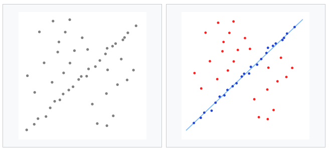

#### 怎么运作？

大致的思路是

  1. 随机筛选一些subset of data，然后fit model出来
  2. 找剩余的data来测试这个model，如果能通过，那就称为inlier data
  3. 不断重复，如果fit的data太少了，这个model就会被reject
  4. 若良好，那么这个dataset就是consensus set
  5. 这个model不断完善，这个consensus set越来越大

#### :star:Pros and Cons

这非常重要，一项技术总有trade-off

##### Pros

若含超过50%的inliers，那么RANSAC会非常robust

##### Cons

反之，若只有例如30%的inlier，那么RANSAC没法找出好东西    

RANSAC是model-dataset一一对应的关系，即一个dataset不可能有两个model。比如是一个折线的scatter plot，那就需要两个model，RANSAC不适合这种情况    

no upper bound计算时间，因此需要根据数据集的复杂程度决定iteration大小

:star:RANSAC的threshold是problem-specific thresholds，例如在我找折线的那个电池，是算的threshold是data point的Y值的差异。那么，当我的模型从1mm变成1000mm，threshold就要改变了


# 7.Robotics🦿

### 1.法兰盘的XYZ和Target的XYZ

关系应该如下图：

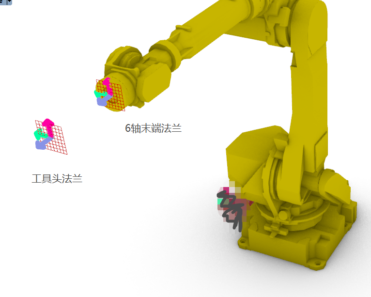

X轴-红色

Y轴-绿色

Z轴-蓝色

记住，法兰盘的Z轴是怼出来的。因此右手法则应该向着法兰盘

:warning:但是这个XY轴并不一定如此！！！！！下面举例，三大机器人品牌，ABB, KUKA, FANUC它们末端法兰的区别。

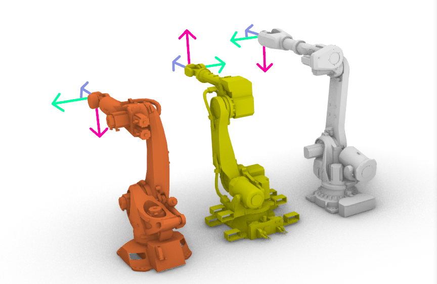

从左到右，KUKA, FANUC, ABB


## 2021-06-10

### 1.KUKA界面


注释；修改指令

密码：KUKA

一般使用模块（module）

module-更改属性-会出现.DAT， .SRC


STOP


forward and backward


custom menu，装好之后有按钮；e.g. 点焊和弧焊


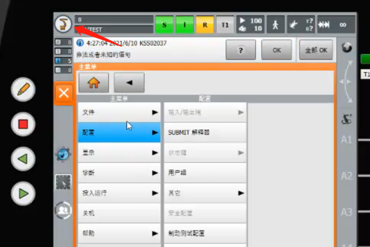

Menu


文件-存档(备份backup)

USB(KCP)示教器上面的USB接口


#### 配置

1.外部启动条件

2.专家

3.其它 - 干涉区域

4.机器配置 - 轴值的范围；软限位(轴值的限制)

5.Submit解释器，SPS是KUKA开机之后就在运行的，一般是运行的逻辑，可以理解为C#的field，监控global variables，防止电流过大，或者拿工具头出错


#### 显示

1.输入/输出

2.实际位置(相当于fanuc的POS)

3.变量(专家模式)

计数器：这个测节拍经常要用到

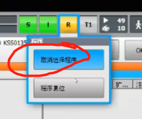

相当于退出该src文件

global variable = 在R1-system-config里面设置好的,所有的机器人程序都能调用


#### 投入运行

1.测量-工具-XYZ4点法（这是我们之前做针尖TCP的时候做的）

2.测量-基座标-3点

3.调整-EMD（就是重新校准KRC，也就是说机械臂撞了，然后轴和轴之间的相对位置改变了，需要用EMD来重新恢复default设置）

4.售后服务-长文本

5.机器人数据 - 机器人的型号和名称


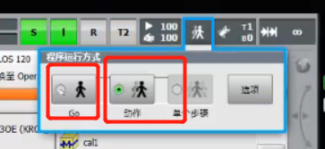


这个类似于FANUC的step，可以一直运行到底，或者运行step by step


TO-DO: 机器人基础编程


### 2.FAUNC

#### 1.创建程序

Menu

`软件工程师培训（机器人基本操作、机器人在线编程基础、KUKA机器人编程四书）\培训资料\发那科机器人编程手册\B-83284CM_04机器人基础编程.PDF`

I/O里面的ITEM相当于KUKA的至，相当于跳到哪个变量

DATA-[类型]-位置寄存器(相当于Robim里面的PR，KUKA的E6个axis)

FCTN - (function) 

GROUP - 打组，相当于把外部轴和机械臂打组，然后你挪外部轴的J7，外部轴会带着你的机械臂挪动。如果你不GROUP，你挪J7，机械臂就相当于只是基座在动。


`J P[1]` 是关节逼近

`L P[1]`是线性逼近

`C P[1]`是arc移动


后台逻辑≈KUKA的SPS


`.ls` 变成 `.tp`程序文件是ASCII转码的

MENU-6系统-2变量-找到MASTER_ENB-把0变成1-就可以改标定零点


### 3.ABB


## 2021-04-27

### 1.FANUC标定针尖TCP

MENU - 6.设置 - 4.坐标系 - F3[编号]找一个空的工具TCP - F2[方法] - 1三点法

然后移动机器人，三个姿态戳点，每个点在`接近点`那里选择SHIFT+F5记录，弄个三组就自动算好了

### 2.怎么切换TCP跑FANUC？

按住`SHIFT+COORD`, 右上角出现`Tool, Jog, User`，选择`Tool`然后输入刚刚设好的几号工具就可以了

