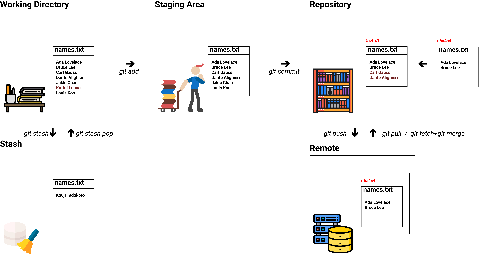
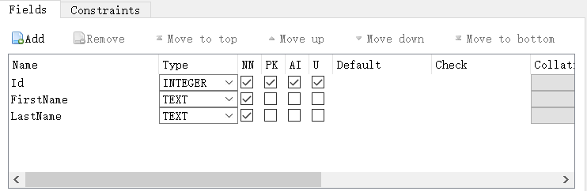

# Overview: The notebook:open_book: of junior software engineer:keyboard:

This notebook is and will be with me in the path of a software engineer working on 3D stuffs. This notebook and is **constantly evolving**.

The topic ranges from programming language like C#, C++, Python, to 3D Software I mostly use like Rhino, Blender, and even to some Algorithm.


# Table of Content

- [Overview](#overview-the-notebookopen_book-of-junior-software-engineerkeyboard)
- [Table of Contents](#table-of-content)
- [0.Installation](#0installation_gear)
- [1.Computer System](#1computer-systemdesktop_computer)
  - [Git](#git%EF%B8%8F)
  - [Shell](#shellshell)
  - [LaTex](#latex)
- [2.Programming Language](#2programming-languagespeaking_head)
  - [C#](#c)
  - [C++](#c-1)
    - [Compile](#compile)
      - [CMake](#cmake)
      - [GCC](#gcc)
    - [C++ Libraries](#c-1-libraries)
      - [Eigen](#eigen)
  - [Python](#python)
- [3.IDE & Text Editor](#3ide--text-editor-memocomputer)
  - [Visual Studio IDE](#visual-studio-ide)
  - [Visual Studio Code](#visual-studio-code)
- [4.Devops](#4devops)
  - [Documentation Tool](#documentation-toolbooks)
  - [Docker](#docker)
- [5.Geometry Kernel](#5geometry-kerneltriangular_ruler)
  - [RhinoCommon & Grasshopper](#rhinocommongrasshopperrhinoceros)
- [6.Algorithm](#6algorithm)
- [7.Robotics](#7robotics)


# 1.Computer System:desktop_computer:

## Git🕷️

### 0.Basic Concepts

📌**VCSs, Git, Github/Gitlab**

VCSs = Version control systems (VCSs)

Git = **Git** is the de facto standard for version control

Github/Gitlab/Gitee = the host of Git Repository


📌 **Snapshots咔嚓**

Git models the history of a collection of files and folders within some top-level directory as a series of snapshots.

```
<root> (tree)
|
+- foo (tree)
|  |
|  + bar.txt (blob, contents = "hello world")
|
+- baz.txt (blob, contents = "git is wonderful")
```


**📌Modeling history: relating snapshots**

In pro words: a history is a **directed acyclic graph (DAG)** of snapshots

 In human words: each snapshot in Git refers to a set of “parents”, the snapshots that preceded it.

```
      this is a commit
            ↑
o <-- o <-- o <-- o
            ^
             \
              --- o <-- o
```

```
      new_feature      new_feature + bug_fix
            ↑               ↗
o <-- o <-- o <-- o <---- o
            ^            /
             \          v
              --- o <-- o
                        ↓
                     bug_fix
```


**📌 Fast-forward and three-way merge**

Fast-forward: the commit all points to a same parent commit

```
o <-- o <-- o <-- o <-- o
```

Three-way merge:

- master and sub no conflicts:heavy_check_mark:, different file
- master and sub no conflicts:heavy_check_mark:, different modification in the same file
- master and sub conflicts:x:

```
o <-- o <-- o <-- o <---- o
            ^            /
             \          v
              --- o <-- o
```


**📌 Data model**

The following mimics the data model in Git in pseudocode.

**File**: it is a bunch of bytes

```
type blob = array<byte>
```

**Directory**: It contains named files and directories

```
type tree = map<string, tree | blob>
```

**Commit**: It has parents, metadata, and the top-level tree

```
type commit = struct 
{
    parents: array<commit>
    author: string
    message: string
    snapshot: tree
}
```

**Object**: It could be a blob, tree, or commit.

```
type object = blob | tree | commit
```

**Data Storage**: In Git data store, all objects are **content-addressed** by their [SHA-1 hash](https://en.wikipedia.org/wiki/SHA-1).

```
objects = map<string, object>

def store(object):
    id = sha1(object)
    objects[id] = object

def load(id):
    return objects[id]
```

**References**: They are pointers to commits. Convert *SHA-1 hash* to *human-readable names*.

```
references = map<string, string>

def update_reference(name, id):
    references[name] = id

def read_reference(name):
    return references[name]

def load_reference(name_or_id):
    if name_or_id in references:
        return load(references[name_or_id])
    else:
        return load(name_or_id)
```

e.g.

`HEAD` is the latest "where we currently are"

`master` refers to a particular snapshot instead of a bunch of hexadecimal string.


📌 **Repositories**

In short, a Git *repository*: it is the data `objects` and `references`.


**📌 A diagram for Git**




### 2.:+1:Goooood resources of Git

**`.gitignore` template**

> ​	https://github.com/github/gitignore

**Software for Git**

> ​	`SourceTree` is a free software managing Git while it provides GUI to interact with Git. Highly recommend! You can download:
>
> ​	https://www.sourcetreeapp.com/

**Book for git**

> ​	https://git-scm.com/book/en/v2

### 3.Some Regular Procedure

**📌Git submodules**

```cmd
git submodule add --depth 1 git@gitee.com:shanghai-dajie-robot/pocket_raichu.git submodules/pocket_raichu
git config -f .gitmodules submodule.pocket_raichu.shallow true
```


```
git config -f .gitmodules submodule.submodules/pocket_raichu.shallow false
```


git submodule foreach git pull origin master


```
git clone <repo_url>
git submodule init
git submodule update --depth 10
```


**📌Setup a Github Access Token**

1. Go to the Github account - Developer Setting - Generate Token
2. Git clone an arbitrary repo from your page
3. When the computer request credential, just close it until it appears on the command line for the following info
   1. `user_name`: the name of your Github account
   2. `password`: paste your token here


## Shell:shell:


### 0.Basic Concept


**📌 ` ` , `""` , `\` used in file name and folder name**

The space ` ` is used to separate the arguments in the command line. e.g.

```bash
mkdir my photo
```

This will create **2** folders which are "my" and "photo". If you want to create a folder with "my photo". You either use `""` to concatenate or use `\` to escape the space.

```bash
mkdir "my photo"
mkdir my\ photo
```


📌`' '` and `" "`

Things inside single quote `' '` are literal string. Meaning what is inside is what is inside.

Things inside double quote `" "` are strings. They can be substituted. 


**📌 `<`, `>` , `>>` in data stream**

`<` take the data stream out...

`>` take the data stream in...

`>>` take the data stream *append* in...

e.g. 

```bash
cat <hello.txt >README.txt
```

It means stream out whatever inside `hello.txt` and stream in `README.txt`

```bash
cat <hello.txt >>README.txt
```

It means stream out content of `hello.txt` and append them at the end of `README.txt`


**📌 `|` pipe**

It means take the output from the left as the input of the right.          `<A=output>  |  <A'=input>`

e.g.

```bash
ls -l | tail -n3
```

`ls -l` prints out all the files. This will be treated as the input of `tail`

`tail -n3` receives the print by `ls -l` and filter the last 3 lines. 


**📌 `r`, `w`, `x` file/folder permissions**

`r` , read

> ​	file: read
>
> ​	dir: allow? to see files in this dir

`w`, write

> ​	file: write
>
> ​	dir: allow? to rename/remove files in this dir

`x`, execute

> ​	file: execute
>
> ​	dir: allow? to enter this dir

`d`, directory

`-`, nope

In the beginning, there are **10** characters.

`0`: indicates if this a directory. `d`: directory; `-`: a file

`1 to 3`: the permission of **file owner**

`4 to 6`: the permission of **the owner group**

`7 to 9`: the permission of **other users**

e.g.

```bash
drwxr-xr-x 1 Xingxin 197121      0 Aug  5 01:15  Autodesk/
-rwxr-xr-x 1 Xingxin 197121   2475 Jul 28 20:01 'Unreal Engine.lnk'*
-rw-r--r-- 1 Xingxin 197121    282 Jul  1 01:43  desktop.ini
```

For `Autodesk/` folder, `drwxr-xr-x`

> ​	`0=d`, this is a directory:heavy_check_mark:, file:x:
>
> ​	`123=rwx`, *owner* can **read**:heavy_check_mark: , **write**:heavy_check_mark: and **execute**:heavy_check_mark: .
>
> ​	`456=r-x`, *owner group* can **read**:heavy_check_mark: , **write**:x: and **execute**:heavy_check_mark: .
>
> ​	`789=r-x`, *other users* can **read**:heavy_check_mark: , **write**:x: and **execute**:heavy_check_mark: .

For `desktop.ini` file, `-rwxr-xr-x`

> ​	`0=-`, this is a directory:x:, file:heavy_check_mark:
>
> ​	`123=rw-`, *owner* can **read**:heavy_check_mark: , **write**:heavy_check_mark: and **execute**:x: .
>
> ​	`456=r--`, *owner group* can **read**:heavy_check_mark: , **write**:x: and **execute**:x: .
>
> ​	`789=r--`, *other users* can **read**:heavy_check_mark: , **write**:x: and **execute**:x: .


**📌 `$` ,  `#`, `sudo` in prompt**

`$` indicates this is a *normal* user permission to this shell

`#` indicates this is a **super** user permission to this shell

`sudo` means **super** user **do**

> ​	running `echo` in *normal* user mode

```bash
$ echo hello
```

> ​	update the `apt-get`

```bash
$ sudo apt-get update
```

> ​	enter super user mode(in this mode, you don't need to add `sudo` anymore). `su` means shift user

```bash
$ sudo su
# echo "I am in the super user mode"
# exit
```


📌**Wildcards matching by `?` and `*`**

 `?` substitute with **1** character.

`*` substitute with **following** characters.

e.g. Suppose you have `main.py main1.py main2.py main3.py`

```bash
$ ls main?.py
main1.py  main2.py  main3.py  #It will substitute anything in `?` position

$ ls ma*
main.py main1.py main2.py main3.py  #It will match all the characters after *
```


📌 **Use `{  }` as a set**

:bulb:(It works very similar to the philosophy of list matching in Grasshopper.)

:star:You can see it as the command will **iterate** what is inside `{ }`

```bash
$ mkdir {dev,src,master}  #create 3 folder at 1 time

$ mv *{.py,.sh} folder  # Will move all *.py and *.sh files

$ convert image.{png,jpg}  #This is equal to `convert image.png image.jpg`

$ touch main{1..28}.py  #It will create main1.py, main2.py ... all the way to main28.py
```


📌**Use `find` to do recursive search**

> ​	1. Find folders in current dir

- `.` means current dir
- `d` means the search target is directory

```bash
$ find . -name dev -type d
```

> ​	2. :star:Find files in depth!!

- `**/bin/*.dll` means no matter what is the front, the most important pattern is `**/bin/*.dll`
- `f` means the search target is file

```bash
$ find . -path '**/bin/*.dll' -type f
```

> ​	3. Find the files been modified

- `-mtime` means modified time
- `-1` means last day

```bash
$ find . -mtime -1
```

> ​	4. Find the files and delete them

- `*.tmp` all the temporary files
- `-exec rm` execute them with remove command

```bash
$ find . -name "*.tmp" -exec rm {} \;
```

> ​	5. Find files by sizes

```bash
$ find . -size +500k -size -10M -name '*.tar.gz'  # Find all zip files with size in range 500k to 10M
```


📌**What is shebang?**

> ​	Different names: 

It is also called `hashbang, pound-bang, or hash-pling.`

> ​	Typical Looking:

Always starts with `#!` at the beginning of a file.

> ​	Objective:

Increase the portability of the script. It will make use of the `PATH` environment and resolve to wherever the command lives in the system.

> ​	Example:

`#!/usr/bin/env python3`  ,  Execute with a Python interpreter, using the `env` program search path to find it.


📌**Arguments**

As you see the above case, there are other definitions of arguments in bash.

- `$0` - Name of the script
- `$1` to `$9` - Arguments to the script. `$1` is the first argument and so on.
- `$@` - All the arguments
- `$#` - Number of arguments
- `$?` - Return code of the previous command. Similar to `return 0` in C++
- `$$` - Process identification number (PID) for the current script
- `!!` - Entire last command, including arguments. A common pattern is to execute a command only for it to fail due to missing permissions; you can quickly re-execute the command with sudo by doing `sudo !!`
- `$_` - Last argument from the last command. If you are in an interactive shell, you can also quickly get this value by typing `Esc` followed by `.`


> ​	Example of using `!!`

Suppose you are at `~`

```bash
$ mkdir /mnt/new  #the prompt will say you don't have permission
$ sudo !!  #Here means `sudo mkdir /mnt/new`
```


> ​	Example of using `$_`

In case you are in `~/Desktop/Dev`

```bash
$ cd ..  #Now you are at ~/Desktop
$ cd $_  #Now you are at ~
```


> ​	Example of taking the variable

```bash
$ foo=$(pwd)
$ echo foo
~/Desktop
```


📌:star:**Use `grep` to find codes** 

> ​	1. `grep` basic

This is a super useful command! It simply check **if A(string/text)** is in **B(file)**.

```bash
$ grep "import" main.py
import numpy as np
import sympy as sp
import pandas as pd
```

Btw, you can check if the return value of the last command

```bash
$ echo $?
0
```

`0` means successfully executed.

> ​	2. `grep`  recursively with `-R`

You can recursively `grep` such pattern

```bash
$ grep -R "numpy" .  #it will find all the files contained "numpy"
```

> 		3.`grep` the history

The following is a pipe. Take the output from `history` command and `grep` if there is `find` in that history

```bash
$ history | grep find
```


📌 **rg (R.I.P. grep)**


> ​	Recursive grep by `rg`

`rg <grep_pattern> -t <type_of-file> <search_location>`

```bash
$ rg "import numpy as np" -t py ./dev
```

> ​	Find files does not match **Regex** pattern

e.g. find files not a shebang

```bash
$ rg -u --files-without-match "^#\!" -t sh
```

>  Find with stats

- `-C 5` means search the surrounding 5 lines

```bash
$ rg "import requests" -t py -C 5 --stats ~/dev
```


📌**`    ||    ` and `    &&    `**

> ​	`A  ||  B`

First check `A=True`:heavy_check_mark: , runs `A` only. 

First check `B=False`:x:, run `B`

> ​	`A  &&  B`

First check `A=True`:heavy_check_mark:, runs `B`

First check `A=False`:x:, does not run anything.

```bash
$ true || echo "This will not be printed"

$ false || echo "This will be printed"
This will be printed

$ true && "This will be printed"
This will be printed

$ false && "This will not be printed"

```


📌**Use `<` to take the output as input**

As mentioned before, the `<` means taking the data out. We can take advantage of this syntax.

```bash
$ diff <(ls dev) <(ls main)
```

The difference between the content of `dev` folder and `main` folder will be printed.


### 2.Shell Scripting

:star:Big Picture: What is shell scripting for? Creating command pipelines, saving results into files, and reading from standard input.

📌**Scripting 101**

```bash
foo=bar
echo "$foo"
# prints bar
echo '$foo'
# prints $foo
```

> ​	1.No space should insert when assigning value

`foo=bar` :heavy_check_mark: , `foo = bar`:x: . Because space ` ` acts as delimiter.

> ​	2.double quote and single quote have been explained.

\

> ​	3. `$` for **interpolation**.

It is very similar to C#. But `$` in shell scripting has way more powerful functionalities.

```c#
int day = 28;
string word = $"Today is {day}-th days of this month.";
```


📌**Scripting 102**

> ​	The shell script is ended with `.sh`

```bash
$ vim mcd.sh
```

> ​	Make a script for 1.`mkdir`  and 2.  `cd` to it
>
> ​	Here `$1` means the 1st argument the user put

```bash
mcd()
{
	mkdir -p "$1"
	cd "$1"
}
```

> ​	After complete the script, store it into the shell

```bash
$ source mcd.sh
```

> ​	Now you can use this command in shell

```bash
$ mcd dev
```


📌**Scripting 103**

Suppose you have `dev.py  main.py  main1.py` 

**Objective**:

1. Find `import numpy as np` in all the files
2. If not, add it

**Make a new bash file**:

```bash
$ vim check_numpy.sh
```

**Script it**:

```bash
echo "Starting program at $(date)" # Date will be substituted

echo "Running program $0 with $# arguments with pid $$"

for file in "$@"; do
    grep "import numpy as np" "$file" > /dev/null 2> /dev/null
    if [[ $? -ne 0 ]]; then
        echo "File $file does not import numpy package, adding one"
        echo "import numpy as np" >> "$file"
    fi
done
```

**Use it**:

```bash
$ ./check_numpy.sh main.py main1.py dev.py
```

**Output**:

```
Starting program at Sun Sep 12 14:12:49     2021
Running program ./check_numpy.sh with 3 arguments with pid 431
File main.py does not import numpy package, now adding one
File main1.py does not import numpy package, now adding one
File dev.py does not import numpy package, now adding one
```

**Explanation**:

1.  `$(date)` , take the output from command `date` and turn into string
2.  `$0` , the current bash script name
3.  `$#` , num of arguments
4.  `$$` , current pid
5.  `for file in "$@"` , loop over the all the arguments(the file names)
6. `"$file"` , turn file into plain text for comparing in `grep`
7.  `/dev/null 2> /dev/null` , normally there are **2** output from `grep` which are **STDOUT** and **STDERR**. So this code means to store the OUT/ERR to the location.
8.  `[ [ ] ]` , when comparing, use double brackets as recommended. 
9.  `-ne` , means *not equal to* , therefore if `grep` can't find `numpy` which is not **0**, then it will execute the following.
10.  `echo XXX >> "$file"` ,  append text into file


### 3.Others

**📌 what is `.\xxx`？**

Suppose we run `dir` in windows(≈`ls` in Unix).  Then you will see:

```bash
2021/07/28  10:20    <DIR>          .
2021/07/28  10:20    <DIR>          ..
2021/07/28  09:41               141 .gitattributes
2021/07/28  09:41    <DIR>          .github
2021/07/28  09:41             5,559 .gitignore
2021/07/28  09:41                 0 .vcpkg-root
2021/07/28  09:41               100 bootstrap-vcpkg.bat
2021/07/28  09:41               109 bootstrap-vcpkg.sh
2021/07/28  10:06    <DIR>          buildtrees
2021/07/28  09:41         1,210,046 CHANGELOG.md
2021/07/28  10:21                93 CMakeDirectory.txt
2021/07/28  09:41             2,432 CONTRIBUTING.md
2021/07/28  09:41    <DIR>          docs
2021/07/28  10:06    <DIR>          downloads
2021/07/28  09:58    <DIR>          installed
2021/07/28  09:41             1,096 LICENSE.txt
2021/07/28  09:41             2,334 NOTICE.txt
2021/07/28  10:06    <DIR>          packages
2021/07/28  09:41    <DIR>          ports
2021/07/28  09:41            12,381 README.md
2021/07/28  09:41            15,908 README_es.md
2021/07/28  09:41            12,459 README_fr.md
2021/07/28  09:41            13,961 README_ko_KR.md
2021/07/28  09:41            11,716 README_zh_CN.md
2021/07/28  09:41    <DIR>          scripts
2021/07/28  09:41               923 shell.nix
2021/07/28  09:41    <DIR>          toolsrc
2021/07/28  09:41    <DIR>          triplets
2021/07/28  09:44         3,359,624 vcpkg.exe
2021/07/28  09:41    <DIR>          versions
```


Therefore, running the following

```bash
.\vcpkg 
```

means run the `vcpkg.exe` in current directory. You can even specify the params:

```bash
.\vcpkg search libigl
```

In this case, it means the author of `vcpkg` leave the argument for you to enter when they build this app.

To conclude, `.\xxx` means execute the `xxx` in current directroy.


📌**How to install oh-my-zsh**

1. Close VPN and install `Windows Terminal` and `Ubuntu` from Microsoft Store
2. `sudo apt-get update`
3. `sudo apt-get upgrade`
4. `sudo apt install zsh`
5. `sh -c "$(curl -fsSL https://raw.githubusercontent.com/ohmyzsh/ohmyzsh/master/tools/install.sh)"`
   1. If it failed. Go to `Internet Properties` , find out the `Proxy` and `Port`
   2. `export https_proxy=http://127.0.0.1:7890 http_proxy=http://127.0.0.1:7890 all_proxy=socks5://127.0.0.1:7890`
6. `git clone --depth=1 https://github.com/romkatv/powerlevel10k.git ${ZSH_CUSTOM:-$HOME/.oh-my-zsh/custom}/themes/powerlevel10k`
7. `vim ~/.zshrc`
8. Set `ZSH_THEME="powerlevel10k/powerlevel10k"`
9. Open the `Setting.json` of Windows Terminal, and paste the guid of Ubuntu to the default terminal.


### 4.Resources of Shell

**ShellCheck - A shell script static analysis tool**

> ​	https://github.com/koalaman/shellcheck

**Unix `env`**

> ​	https://www.man7.org/linux/man-pages/man1/env.1.html

**`tldr` package**

> ​	https://tldr.sh/


## LaTex

### Symbol and Letters

| Appearance                       | Code          |
| -------------------------------- | ------------- |
| $\tilde{M}$                      | `\tilde{}`    |
| $\equiv$ , equivalent to         | `\equiv`      |
| $\not\equiv$ , not equivalent to | `\not\equiv`  |
| $\bar{A}$                        | `$\bar{A}$`   |
| $\hat{A}$                        | `$\hat{A}$`   |
| $\tilde{A}$                      | `$\tilde{A}$` |


### Vectors and Matrix

📌  **vertical dashed lines inside a matrix**

> ​	The `c` in `{c:c}` represents the column while `:` represents the dashed line.
>
> ​	Therefore, `{c:c}` means the dashed line start from *1* column from the left.

```latex
\begin{array}{c:c}
1 &  2 \\ 
3 & 4 \\
5 & 6 \\ 
\end{array}
```

$\begin{array}{c:c}
1 &  2 \\ 
3 & 4 \\
5 & 6 \\ 
\end{array}$

📌 **Matrix Template**

```latex
\begin{bmatrix}
1&0&0\\
0&1&0\\
0&0&1\\
\end{bmatrix}
```

$\begin{bmatrix}
1&0&0\\
0&1&0\\
0&0&1\\
\end{bmatrix}$

**📌Determinant Template**

```latex
\begin{vmatrix}
1 & 4 & 1 \\ 
0 & -2 & 1 \\ 
0 & 2 & 1
\end{vmatrix}
```

$\begin{vmatrix}
1 & 4 & 1 \\ 
0 & -2 & 1 \\ 
0 & 2 & 1
\end{vmatrix}$


### Documentation

📌 **Reference equation by tag**

> ​	You create the equation with `label` and `tag`.

```latex
$ a = b \tag{a}\label{a} $
```

> ​	Then you can reference the equation:

```latex
$ \eqref{a} $
```


# 2.Programming Language:speaking_head:

## C#

### 1.Types

#### 1.1Value Types

#### 1.2Reference Types

##### interface

📌**define an interface and implement it**

例如我定义了

```c#
interface IParam
{
    Vector3d WorldX { get; }
}
```

然后我也显示实现了WorldX

```c#
public class Param : IParam
{
    Vector3d IParam.WorldX
    {
        get => new Vector3d(1, 0, 0);
    }
}
```

:x: 但是为什么我无法调用World?如下

```c#
Vector3d IParam.SafeShift
{
    get => IParam.WorldX * 2.5;
}
```

仔细想想，`IParam`是什么？它是接口，接口怎么会有instance(实例化)？！？对吧？理解这个东西之后，我们需要把`IParam`显示指定实例化`this`，这样：

```c#
Vector3d IParam.SafeShift
{
    get => ((IParam)this).WorldX * 2.5;
}
```

📌**difference between explicit and implicit implementation**

首先我定义了接口

```c#
interface IParam
{
    double X { get; }
    double Y { get; }
}
```

> explicitly implement an interface

我显示实现(explicitly)：

```c#
public class ParamP : IParam
{
    double IParam.X { get => 1; }
    double IParam.Y { get => 2; }
}

public class ParamZ : IParam
{
    double IParam.X { get => 10; }
    double IParam.Y { get => 20; }
}
```

那么我在用的时候，需要这样：

```c#
IParam pp = new ParamP() as IParam;
IParam pz = new ParamZ() as IParam;
```

或者这样：

```c#
ParamP pp = new ParamP();
ParamZ pz = new ParamZ();
IParam p;
p = flag ? pp as IParam : pz as IParam;
```

> ​	implicitly implement an interface

我隐式实现：

```c#
public class ParamP : IParam
{
    public double X { get => 1; }
    public double Y { get => 2; }
}

public class ParamZ : IParam
{
    public double X { get => 10; }
    public double Y { get => 20; }
}
```

那我就可以直接用了：

```c#
ParamP pp = new ParamP();
ParamZ pz = new ParamZ();
```

为什么这么设计呢？

你可以想象interface前面都是virtual，如果你不public，怎么override它呢？


### 2.Keywords

#### 2.1Modifiers

##### Access Modifiers

📌`private` vs `internal`

> **internal** is for assembly scope (i.e. only accessible from code in the same .exe or .dll)
>
> **private** is for class scope (i.e. accessible only from code in the same class).

#### 2.2.Statement

**2.2.1.Iteration Statement**

**📌 How to loop backward in `foreach`?**

```c#
//use `.Reverse()`
int[] arr = new int[]{1,2,3,4,5,6};
foreach(int i in arr.Reverse())
{
    Console.WriteLine(i.ToString());
}
//Reverse list return void, so first cast to array
List<int> list = new List<int>{1,2,3,4,5,6};
foreach(int i in list.ToArray().Reverse())
{
    Console.WriteLine(i.ToString());
}
```


**2.2.2.Selection Statement**

#### 2.3Method Parameters

📌 **how to use `out`？**

```c#
public static void Run(out List<Plane> planes, out List<string> commands)
{
    //用out的话，一定要在最前面赋值！！
    planes = new List<Plane>();
    commands = new List<string>();
    //然后对这些List进行操作
    planes.Add(Plane.WorldXY);
    planes.Add(Plane.WorldYZ);
    planes.Add(Plane.WorldZX);
    commands.Add("Hello!");
    commands.Add("My name is John!");
}
```

在调用的时候是这样：

```c#
List<Plane> ps = new List<Plane>();
List<string> ss = new List<string>();
Run(out ps, out ss);
```


#### 2.4.Namespace

#### 2.5.Generic Type Constraint

#### 2.6.Access

#### 2.7.Literal

#### 2.8.Contextual

#### 2.9.Queries

📌**Select没有返回值的item**

> ​	假设你有`List<Curve> crvs`，你想对它们整体偏移。那么你可能会：

```c#
using System.Linq;
var shiftCrvs = crvs.Select(crv => crv.Translate(100, 0, 0)).ToList();
```

> ​	但是实际上你可能得到的是一系列`boolean`， 因为

```c#
public bool Translate(
	double x,
	double y,
	double z
)
```

> ​	因此应该怎么做呢？

```c#
var shiftCrvs = crvs.Select(crv => {crv.Translate(100,0,0); return crv;}).ToList();
```

> 过程其实一目了然，
>
> 1.先选择`crv`为crvs里的每一row，
>
> 2.然后`{}`是对`crv`的操作。
>
> 3.该操作是，先`Translate`，然后`return`该已经位移的crv


📌**use `Take` to split a list**

> ​	imagine you have a list of 10 `double`, and you want to split the list into two chunks

```c#
List<double> doubleList = new List<double> { 0, 1, 2, 3, 4, 5, 6, 7, 8, 9, 10 };
var firstFour = doubleList.Take(4).ToList();  //now you have the first four item
```


📌**use `Skip` to bypass items** 

> ​	it is sort of dual method of `Take` which bypass certain amount of elements

```c#
List<double> doubleList = new List<double> { 0, 1, 2, 3, 4, 5, 6, 7, 8, 9, 10 };
var lastSix = doubleList.Skip(4).ToList();  //now you have the last six item
```


📌**Create a list of booleans like in Python**

```c#
using System.Linq;

List<double> Z;
var allFalse = Enumerable.Repeat(false, Z.Count);
```


📌 **Combine two list and return a new list**

```c#
var z = x.Concat(y).ToList();  //the `concat` would not affect either x or y
```


📌 **Sort a list by list value**

```c#
using System.Linq;

//sorts in acending order {1,2,3,4,5}
myList.Sort();

//Sorts in decending order {5,4,3,2,1}
myList.Sort();
myList.Reverse();
```


📌 **Set operation**

| **Method Name** | **Description**              |
| --------------- | ---------------------------- |
| Distinct        | Removes duplicates           |
| Except          | Returns the set difference   |
| Intersect       | Returns the set intersection |
| Union           | Returns the set union        |

```c#
using System.Linq;

List<int> LA = new List<int>() { 1, 2, 2, 3 };
List<int> LB = new List<int>() { 3, 4, 5, 6 };
var LC = LA.Distinct().ToList();  //{1, 2, 3}
var LC = LA.Except(LB).ToList();  //{1, 2}
var LC = LA.Intersect(LB).ToList();  //{3}
var LC = LA.Union(LB).ToList();  //{1, 2, 3, 4, 5, 6}
```

:bangbang: If you notice, the result are all `set` no matter if it `.Distinct()`. That is due to the `Set` operation literally.


📌**Pro Way to Query a List**

Don't use `List[0]`, rather than `FirstOrDefault()`


**📌Find a Single element from a List**

Suppose you have an id, you have to query an object from a list which matches the id.

```c#
string plateId  = "5ca99c57-2cc2-4f65-b5db-83afca088264";
var plate = PlateDtoList.SingleOrDefault(dto => dto.Id == plateId);
```


### 3.Operators and expressions

### 4.Statements

#### Selection statements

📌  **Multiple condition in ONE `case`**

`case [data_type] [data_name] when [condition]`

```c#
switch (this.diameter)
{
    case 6:
        return 35.0;
    case 8:
        return 20.0;
    case int n when (n >= 16 && n <= 28):
        return 20;
    default:
        throw new Exception($"No data for {this.diameter}mm steel.");
}
```


### 12.C# Nuget Package

| Name             | Link                                                         | Function                |
| ---------------- | ------------------------------------------------------------ | ----------------------- |
| Super Simple TCP | https://github.com/jchristn/SuperSimpleTcp                   | TCP client and server   |
| MVVM Tooklit     | https://docs.microsoft.com/en-us/windows/communitytoolkit/mvvm/introduction | Successor of MVVM Light |
|                  |                                                              |                         |


### 13.未整理


## C++

### C++ header template

```c++
/************************************************************************\


Copyright (c) 2021 HE, Xingxin


Module Name:

	xxx.


Notes:
	[Optional]


History:
	Created on mm/dd/yyyy xingxin.he@mail.polimi.it


\************************************************************************/
```


### 1.C4996, `fopen`: This function or variable may be unsafe.

当你用Visual Studio IDE去编译C++的时候，经常会遇到

``` bash
'fopen': This function or variable may be unsafe. 
'fscanf': This function or variable may be unsafe. 
```

:heavy_check_mark: 解决方案是：

Select your project and click `Properties` in the context menu.

In the dialog, chose `Configuration Properties` -> `C/C++` -> `Preprocessor`

In the field `PreprocessorDefinitions` add `;_CRT_SECURE_NO_WARNINGS` to turn those warnings off.


然后，

`Configuration Properties` > `C/C++` > `Advanced` property page.

Edit the `Disable Specific Warnings property` to add *`4996`*


:warning: 需要注意的是，上面更改Properties的地方是`x64`，但是你Build的时候有可能是`x86`！！！因此，最好properties两个platform都改。

### 2.C2440, cannot convert from `char *` to `LPWSTR`

`Project`=>`Properties`=>`Configuration Properties`=>`Advanced`=>`Character Set`=>`Use Multi-Byte Character Set`:heavy_check_mark:

### 3.E0135 namespace "std" has no member "filesystem"

Because `std::filesystem` is a feature of C++17.

`Project`=>`Properties`=>`Configuration Properties`=>`C/C++`=>`Language`=>`C++ Language Standard`=>`ISO C++17 Standard (/std:c++17)`:heavy_check_mark:

### 4.How do you know Project Property Inheritance?

On a property page, a property in **bold** is defined in the current context. A property in normal font is inherited.

e.g. The following **bold** label like `C++ Language Standard` is defined by myself.


### 5.Use `Property Manager` to apply your setting across different projects

If you are tired of setting `Property` manually in VS IDE, you can set up a property sheet(*.props*) to apply the setting.

**View** > **Property Manager** or **View** > **Other Windows** > **Property Manager**


### Compile

#### CMake

📌**Install from Ubuntu**

1. First you have to make sure you have already `gcc` which contains `make` command for C binaries.
2. Make sure you installed `OpenSSL` package

```bash
$ sudo apt-get install libssl-dev
$ wget http://www.cmake.org/files/v3.21/cmake-3.21.2.tar.gz
$ tar xzf cmake-3.21.2.tar.gz
$ cd cmake-3.21.2
$ ./configure --prefix=/opt/cmake
$ make  #for compilation
$ sudo make install  
$ /opt/cmake/bin/cmake -version  #check if installed
```


📌**CMake 101**

> ​	Setup⚙

Suppose you have the following file structure:

```
├── CMake101
│   ├── CMakeLists.txt
│   ├── main.cpp
```

The CMake file looks like this:

```cmake
#specify the minimum CMake version
cmake_minimum_required(VERSION 3.10)

#get the directory name as the project name, stored in the variable ProjectId
get_filename_component(ProjectId ${CMAKE_CURRENT_SOURCE_DIR} NAME)
#    this REPLACE means replacing the space to "_" in case the project including white space
string(REPLACE " " "_" ProjectId ${ProjectId})

#set the project
project(${ProjectId})

# add the executable, cmake will automatically find the header files
add_executable(${ProjectId} main.cpp)
```


> ​	Build🔨 - option1 (recommend✌)

When you are in the folder `CMake101`, open the shell. Do the following commands:

```shell
$ cmake -B build -G "Visual Studio 17 2022"
```

The `-G` stands for generator. You can search `cmake generator` on explorer to find out more options.

After this command, CMake will create a subfolder called `build` in this folder with `makefile`. The structure becomes:

```
.
└── 📁CMake101
    ├── 📃CMakeLists.txt
    ├── 📁build
    │   ├── ALL_BUILD.vcxproj
    │   ├── ALL_BUILD.vcxproj.filters
    │   ├── CMake101.dir
    │   ├── CMake101.sln
    │   ├── CMake101.vcxproj
    │   ├── CMake101.vcxproj.filters
    │   ├── CMakeCache.txt
    │   ├── CMakeFiles
    │   ├── Debug
    │   ├── ZERO_CHECK.vcxproj
    │   ├── ZERO_CHECK.vcxproj.filters
    │   └── cmake_install.cmake
    └── 📃main.cpp
```

After you modify the codes, and you really want to **build** it(this is equivalent to press the `Build` button in VS IDE). You can:

```shell
$ cmake --build build
```

The structure becomes:

```
.
└── 📁CMake101
    ├── 📃CMakeLists.txt
    ├── 📁build
    │   ├── ALL_BUILD.vcxproj
    │   ├── ALL_BUILD.vcxproj.filters
    │   ├── CMake101.dir
    │   ├── CMake101.sln
    │   ├── CMake101.vcxproj
    │   ├── CMake101.vcxproj.filters
    │   ├── CMakeCache.txt
    │   ├── CMakeFiles
    │   ├── Debug
    │   │   ├── CMake101.exe  👈
    │   │   └── CMake101.pdb  👈
    │   ├── ZERO_CHECK.vcxproj
    │   ├── ZERO_CHECK.vcxproj.filters
    │   └── cmake_install.cmake
    └── 📃main.cpp
```


> ​	Build🔨 - option2

When you are in the `CMake101` folder, you type:

```bash
$ mkdir build
$ cd build
$ cmake ..
```

The preceding operation is equivalent to the previous one. This is common but in-and-out a folder seems complicate to me.

```
.
└── 📁CMake101
    ├── 📃CMakeLists.txt
    ├── 📁build
    │   └── ... 👈(you are here)
    └── 📃main.cpp
```


**📌CMake102**

In this section, we will demonstrate how to add a library in CMake. ([code](./code/CMake/CMake102))

> ​	Setup⚙

Suppose you have the following files:

```
.
└── 📁CMake102
    ├── 📃CMakeLists.txt
    ├── 📃main.cpp      👈#include "math.h" in the top
    ├── 📃math.cpp      👈suppose this is the library
    └── 📃math.h        👈suppose this is the library
```


> ​	CMake

```cmake
cmake_minimum_required(VERSION 3.10)
project(cmake102)

#🤚 add library here.
#                     1st argument is the library name
#                     The STATIC means static library, in Windows is `.lib`
#                     The SHARED means dynamic link library, in Windows is `.dll`
#                     3rd argument is the compile source of the library
add_library(math_lib STATIC math.cpp)

add_executable(cmake102 main.cpp)

#add linker to the project
#                      1st argument is the project
#                      3rd argument is the library
target_link_libraries(cmake102 PUBLIC math_lib)
```


> ​	Build🔨 - (MinGW and make)

```bash
$ cmake -B build -G "MinGW Makefiles"
```

After that, you would have

```
.
└── 📁CMake102
    ├── 📃CMakeLists.txt
    ├── 📁build
    │   ├── CMakeCache.txt
    │   ├── CMakeFiles
    │   ├── Makefile             👈this is the Makefile
    │   └── cmake_install.cmake
    ├── 📃main.cpp
    ├── 📃math.cpp
    └── 📃math.h
```

Change to `build` folder then simply type `make`:

```bash
$ cd build
$ make
```

> ​	Build with `STATIC` in CMake

You will have:

```
.
└── 📁CMake102
    ├── 📃CMakeLists.txt
    ├── 📁build
    │   ├── CMakeCache.txt
    │   ├── CMakeFiles
    │   ├── Makefile             
    │   ├── cmake102.exe          👈this is the executable
    │   ├── cmake_install.cmake   
    │   └── libmath_lib.a         👈this is the static library, since I use gnu, so it is `.a`
    ├── 📃main.cpp
    ├── 📃math.cpp
    └── 📃math.h
```

> ​	Build with `SHARED` in CMake

You will have:

```
.
└── 📁CMake102
    ├── 📃CMakeLists.txt
    ├── 📁build
    │   ├── CMakeCache.txt
    │   ├── CMakeFiles
    │   ├── Makefile
    │   ├── cmake102.exe         👈this is the executable
    │   ├── cmake_install.cmake
    │   ├── libmath_lib.dll      👈this is the shared library
    │   └── libmath_lib.dll.a  
    ├── 📃main.cpp
    ├── 📃math.cpp
    └── 📃math.h
```


**📌Key Difference between `SHARED` and `STATIC` library🌟**

For `SHARED` library, the library should be with executable.

✔

```
│   ├── cmake102.exe
│   ├── libmath_lib.dll  
```

❌

```
│   ├── cmake102.exe
│   ├── libmath_lib.dll  
```


For `STATIC` library, you can delete the `.lib` or `.a` file. Since everything in the library has been written into the executable.

✔

```
│   ├── cmake102.exe
```

✔

```
│   ├── cmake102.exe
│   ├── libmath_lib.a   
```


**📌Choose `SHARED` or `STATIC` when you press CMake**

You can modify the following line in `CMakeLists.txt`:

```cmake
add_library(math_lib STATIC math.cpp)
```

to

```cmake
add_library(math_lib math.cpp)
```

You can rather do it like this:

> ​	`SHARED`

```bash
$ cmake -B build -G "MinGW Makefiles" -DBUILD_SHARED_LIBS=ON
```

> ​	`STATIC`

```bash
$ cmake -B build -G "MinGW Makefiles" -DBUILD_SHARED_LIBS=OFF
```


#### GCC

📌**Install from Ubuntu**

```bash
$ sudo apt update
$ sudo apt install build-essential
$ sudo apt-get install manpages-dev
$ gcc --version  #verified you have already installed
```


📌**What is GCC and G++?**

gcc: GNU Compiler Collections(for **compile C and C++**)

g++: GNU c++ compiler(for **compile C++**)

📌**Simplest Compile**

`g++ <fileName.cpp>`  . The default build is `a.out` in Linux and `a.exe` in Windows

```bash
$ g++ helloworld.cpp
$ ./a.exe
Hello, world!
```

📌**Use `-o` to specify output name** 

```bash
g++ helloworld.cpp -o helloworld
```


📌**Compile in C++11 standard**

Use `-std=c++11`

```bash
g++ -g -Wall -std=c++11 main.cpp
```


📌**Frequently Used Commands**

https://www.runoob.com/cplusplus/cpp-environment-setup.html

| Flag or Option | Notes                   |
| -------------- | ----------------------- |
| `-Wall`        | Generate all the errors |
|                |                         |
|                |                         |

📌****


📌****


📌****


📌****


📌****


📌****


📌****


📌****


### C++ Libraries:books:

#### Eigen

📌 **Initialization before operation is a must**

```c++
#include <Eigen/Dense>

Eigen::Vector3d rhs;
{
    //operations on `rhs`
}
```

In this situation, the `rhs` will be super super big like $e^{23} $. Therefore, a good practice is to **initialize** before using it.

```c++
#include <Eigen/Dense>
#include <Eigen/Core>

//you may have some specific size
int numRow = 10;
int numColumn = 10;

//declare
Eigen::MatrixXd matrix;
Eigen::VectorXd rhs;
matrix.resize(numRow, numColumn);
rhs.resize(numRow);

//init with zero
matrix.setZero();
rhs.setZero();
```

##### Matrix Class

**📌 Class Overview**

The concept of `vector` and `matrix` are all in this class since `vector` can be see as a $n\cross 1$ `matrix`.

📌 **Tricks to Know the Type**

> ​	`MatrixXd` ,  `X=dynamic` the dimension can be define later, `d=double` this is a double type matrix.   

> ​	`Vector3f` , `3=3rows`, `f=float`.

📌 **Mandatory Variable**

There are **3** mandatory variables in `Matrix` class.

```c++
Matrix<typename Scalar, int RowsAtCompileTime, int ColsAtCompileTime>
```

> ​	`Scalar` is the scalar type, i.e. the type of the coefficients.

> ​	`RowsAtCompileTime`  and `ColsAtCompileTime` are the dimension of matrix.

Therefore you can define as follow:

```c++
typedef Matrix<float, 4, 4> Matrix4f;
typedef Matrix<double, 3, 1> Vector3d;
```

📌 **Vector as a matrix**

In Eigen, `vector` can be seen as a special case of `matrix`, with **either 1 row or 1 column**.

> ​	column vector (default)

```c++
typedef Matrix<float, 3, 1> Vector3f;
```

> ​	row vector

```c++
typedef Matrix<int, 1, 2> RowVector2i;
```

📌 **Dynamic as X**

Use `Dynamic` to indicate that **the size is unknown at compile time**.

> ​	Fixed size

```c++
typedef Matrix<double, 3, 3> Matrix3d;
```

> ​	Dynamic size

```c++
typedef Matrix<double, Dynamic, Dynamic> MatrixXd;
typedef Matrix<int, Dynamic, 1> VectorXi;
```

📌**Constructor**

> ​	Matrix Init:heavy_check_mark: , Size Init:heavy_check_mark:, Coefficients Init:x:

```c++
Matrix3f a;
```

> ​	Matrix Init:heavy_check_mark: , Size Init:x:, Coefficients Init:x:

```c++
MatrixXf b;
```

> ​	Matrix Init:heavy_check_mark: , Size Init:heavy_check_mark:, Coefficients Init:x:

```c++
MatrixXf a(10,15);
VectorXf b(30);
```

> ​	Matrix Init:heavy_check_mark: , Size Init:heavy_check_mark:, Coefficients Init:heavy_check_mark:

```c++
//Vector
Vector2i a(1, 2);
Vector3d b(5.0, 6.0, 7.0);
Vector4d c(5.0, 6.0, 7.0, 8.0);
Matrix<int, 5, 1> b {1, 2, 3, 4, 5};  //column vector
Matrix<int, 1, 5> c = {1, 2, 3, 4, 5};  //row vector

//Matrix
MatrixXi a {      // construct a 2x2 matrix
      {1, 2},     // first row
      {3, 4}      // second row
};
Matrix<double, 2, 3> b {
      {2, 3, 4},
      {5, 6, 7},
};
```

📌**Coefficient accessors**

The accessor and constructor are the same... which is the *overloaded* bracket `( )`.

```c++
#include <iostream>
#include <Eigen/Dense>
 
using namespace Eigen;
 
int main()
{
  MatrixXd m(2,2);
  m(0,0) = 3;
  m(1,0) = 2.5;
  m(0,1) = -1;
  m(1,1) = m(1,0) + m(0,1);
  std::cout << "Here is the matrix m:\n" << m << std::endl;
  VectorXd v(2);
  v(0) = 4;
  v(1) = v(0) - 1;
  std::cout << "Here is the vector v:\n" << v << std::endl;
}
```

`m(1,0) = 2.5`  is  $M_{1,0}=2.5$

📌 **Comma-initialization**

```c++
//Fixed size
Matrix3f m;
m << 1, 2, 3,
     4, 5, 6,
     7, 8, 9;
cout << m;

//Dynamic size
MatrixXd M(3,3);
M << 1, 0, 0,
     0, 1, 0,
     0, 0, 1;
cout << M << endl;
```

📌 **Size, Resize, and conservativeResize**

`rows()` gets numbers of rows in this matrix.

`cols()` gets numbers of columns in this matrix.

`size()` gets numbers of coefficients in this matrix.

```c++
int main()
{
  Matrix4d m;
  std::cout << "The matrix m is of size "
            << m.rows() << "x" << m.cols() << std::endl;
  std::cout << "It has "
      		<< m.size() << "elements." << std::endl;
}
```

> ​	:warning: Only dynamic-size matrix can use `resize()` to change its dimension.

```c++
int main()
{
  //Matrix resize
  MatrixXd m(2,5);
  m.resize(4,3);
  //Vector resize
  VectorXd v(2);
  v.resize(5);
}
```

> ​	:warning:`resize()` may change the coefficients but `conservativeResize()` preserve its original value

 ```c++
 int main()
 {
 	MatrixXd m = MatrixXd::Random(3, 3);
 	cout << "m =" << endl << m << endl;
 
 	m.conservativeResize(4, 4);  //the value of coefficients in the row 4 and col4 are not init
 	cout << m << endl;
 }
 ```

📌 **Assignment are reference type**

```c++
MatrixXf a(2,2);
MatrixXf b(3,3);
a = b;
std::cout << "a is now of size " << a.rows() << "x" << a.cols() << std::endl;
```

📌 **When should use Fixed or Dynamic?**

|        | Fixed                                  | Dynamic                                   |
| ------ | -------------------------------------- | ----------------------------------------- |
| Choice | for very small sizes **where you can** | for larger sizes or **where you have to** |
| Memory | Stack                                  | Heap                                      |

:checkered_flag: The *fixed-sized* matrix is nothing but a plain array.

```c++
//the followings are equivalent
MatrixXf mymatrix(rows,columns); 
float *mymatrix = new float[rows*columns]; 
```

:warning: When the dimension is extremely big, performance has no difference between two choice.

:bangbang: When you try to use *fixed-size* for an extremely big data like a Mesh(e.g. $V=1500;F=600$), it could result a **stackoverflow**.

📌 **Complete Variables**

> ​	The first 3 has been discussed above. The following will focus on the last 3.

```c++
Matrix<typename Scalar,
       int RowsAtCompileTime,
       int ColsAtCompileTime,
       int Options = 0,
       int MaxRowsAtCompileTime = RowsAtCompileTime,
       int MaxColsAtCompileTime = ColsAtCompileTime>
```

> ​	`Options` indicate how we iterate the element in a matrix.

For example a $3\cross 4$ Matrix.
$$
\begin{bmatrix}
8& 2& 2& 9\\
9& 1& 4& 4\\
3& 5& 4& 5\\
\end{bmatrix}
$$

> > ​	Iterate in column-major(**default**):

```c++
Matrix<int, 3, 4, ColMajor> A;
A << 8, 2, 2, 9,
	 9, 1, 4, 4,
	 3, 5, 4, 5;
cout << "In memory (column-major):" << endl;
for (int i = 0; i < A.size(); i++)
  cout << *(A.data() + i) << "  ";
```

It will print: `8  9  3  2  1  5  2  4  4  9  4  5`.

> > ​	Iterate in row-major:

```c++
Matrix<int, 3, 4, RowMajor> A;
A << 8, 2, 2, 9,
	 9, 1, 4, 4,
	 3, 5, 4, 5;
cout << "In memory (row-major):" << endl;
for (int i = 0; i < A.size(); i++)
  cout << *(A.data() + i) << "  ";
```

It will print: `8  2  2  9  9  1  4  4  3  5  4  5`.

> ​	`MaxRowsAtCompileTime` and `MaxColsAtCompileTime` are fixed upper bound known at compile time. Which is very handy to avoid dynamic memory allocation

```c++
Matrix<float, Dynamic, Dynamic, 0, 3, 4>
```


##### Matrix and vector arithmetic

📌 **Addition, subtraction, multiplication, and division**

Nothing special, since the `+,-,*,/` have been overloaded by Eigen.

The compound version is also fine: `+=, -=, *=, /=`

📌**Transposition and conjugation** , (possible aliasing effect)

The transpose $A^T$, conjugate $\bar{A}$, and adjoint (i.e., conjugate transpose) $A^*$ of a matrix $A$ or vector $A$ are obtained by the member functions

- `transpose()`
- `conjugate()`
- `adjoint()`

:warning:WARNING!! `transpose()` and `adjoint()` simply return a **proxy** object without doing the actual transposition. If you want to assign its transpose, you need to use `transposeInPlace()`.

> ​	:x: WRONG EXAMPLE, so called [aliasing effect](https://eigen.tuxfamily.org/dox/group__TopicAliasing.html)

```c++
Matrix2i a; a << 1, 2, 3, 4;
cout << "Here is the matrix a:\n" << a << endl;
 
a = a.transpose(); // !!! do NOT do this !!!
cout << "and the result of the aliasing effect:\n" << a << endl;
```

> ​	:heavy_check_mark:CORRECT EXAMPLE

```c++
MatrixXf a(2,3); a << 1, 2, 3, 4, 5, 6;
cout << "Here is the initial matrix a:\n" << a << endl;

a.transposeInPlace();
cout << "and after being transposed:\n" << a << endl;
```

📌 **Matrix-matrix and matrix-vector multiplication** , (no aliasing effect)

> ​	nothing special, just use `*` and `*=`.

There are matrix $M=\begin{bmatrix}1&2\\3&4\end{bmatrix}$ , and vector $u=\begin{bmatrix}-1\\1\end{bmatrix}, v=\begin{bmatrix}2\\0\end{bmatrix}$ 

```c++
Matrix2d M;
M << 1, 2,
3, 4;
Vector2d u(-1,1), v(2,0);
```

> ​	$MM$, matrix * matrix

```c++
std::cout << "matrix * matrix:\n" << M*M << std::endl;
```

> ​	$Mu$ , matrix * vector

```c++
std::cout << "matrix * vector:\n" << M*u << std::endl;
```

> ​	$u^TM$ , column-vector * matrix

```c++
std::cout << "column-vector * matrix:\n" << u.transpose()*M << std::endl;
```

> ​	$uv^T$ , column-vector * row-vector

```c++
std::cout << "column-vector * row-vector:\n" << u*v.transpose() << std::endl;
```

📌 **dot product and cross product**

> ​	just use `.dot()` , `.cross()` , and `.adjoint()`

```c++
#include <iostream>
#include <Eigen/Dense>
 
using namespace Eigen;
using namespace std;
int main()
{
  Vector3d v(1,2,3);
  Vector3d w(0,1,2);
 
  cout << "Dot product: " << v.dot(w) << endl;
  double dp = v.adjoint()*w; // automatic conversion of the inner product to a scalar
  cout << "Dot product via a matrix product: " << dp << endl;
  cout << "Cross product:\n" << v.cross(w) << endl;
}
```

📌 **arithmetic reduction operations**

`.sum()` , the sum of all coefficients

`.prod()` , the product of matrix

`.maxCoeff()` , the maximum of all coefficients

`.minCoeff()` ,  the minimum of all coefficients

`.trace()` , the sum of diagonal , equivalent to `.diagonal().sum()`

```c++
#include <iostream>
#include <Eigen/Dense>
 
using namespace std;
int main()
{
  Eigen::Matrix2d M;
  M << 1, 2,
         3, 4;
  cout << "M.sum():       " << mat.sum()       << endl;
  cout << "M.prod():      " << mat.prod()      << endl;
  cout << "M.mean():      " << mat.mean()      << endl;
  cout << "M.minCoeff():  " << mat.minCoeff()  << endl;
  cout << "M.maxCoeff():  " << mat.maxCoeff()  << endl;
  cout << "M.trace():     " << mat.trace()     << endl;
}
```

And we have `10, 24, 2.5, 1, 4, 5`

:star: You can also get back the index of row and column by using `&<index>`

```c++
#include <iostream>
#include <Eigen/Dense>
 
using namespace std;
int main()
{
  Eigen::Matrix2d M;
  M << 1, 2,
         3, 4;
  Eigen::RowVector3i V;
  V << 9, 8, 7;
    
  std::ptrdiff_t i, j;
  
  //Get the min and its index of a matrix
  float minOfM = M.minCoeff(&i,&j);
  cout << minOfM << i << j << endl;

  //Get the max index of a vector
  int maxOfv = V.maxCoeff(&i);
  cout << maxOfv << i << endl;
}
```


##### Array class and coefficient-wise operations

:star: Big picture before diving in. The design of `Array` class aims to conduct *coefficient-wise*(**element-wise**) operation.

📌 **Array types**

The types of `Array` class is very similar to `Matrix` in addition to its *element-wise* operation. You can define it in the way of  `Matrix` class.

```c++
Array<typename Scalar, int RowsAtCompileTime, int ColsAtCompileTime>
```

There are also some common types already defined in Eigen.

| Type                             | Typedef     |
| -------------------------------- | ----------- |
| `Array<float,Dynamic,1> `        | `ArrayXf `  |
| `Array<float,3,1> `              | `Array3f `  |
| `Array<double,Dynamic,Dynamic> ` | `ArrayXXd ` |
| `Array<double,3,3> `             | `Array33d`  |

📌 **Accessing values inside an array**

access and assign values are no difference with `Matrix` class.

```c++
#include <Eigen/Dense>
#include <iostream>
 
using namespace Eigen;
using namespace std;
 
int main()
{
  ArrayXXf  m(2,2);
  
  // assign values by row-col
  m(0,0) = 1.0; m(0,1) = 2.0;
  m(1,0) = 3.0; m(1,1) = m(0,1) + m(1,0);
  
  // print
  cout << m << endl << endl;
 
  // using the comma-initializer
  m << 1.0,2.0,
       3.0,4.0;
     
  // print
  cout << m << endl;
}
```

📌 **Element-wise arithmetic operation**

> ​	Array-scalar operation

```c++
#include <Eigen/Dense>
#include <iostream>
 
using namespace Eigen;
using namespace std;
 
int main()
{
  ArrayXXf a(3,3);
  a << 1,2,3,
       4,5,6,
       7,8,9;

  // Subtracting a scalar from an array
  cout << "a - 2 = " << endl << a - 2 << endl;
  //
  //  -1  0  1
  //   2  3  4
  //   5  6  7
}
```

> ​	Array-Array operation

```c++
#include <Eigen/Dense>
#include <iostream>
 
using namespace Eigen;
using namespace std;
 
int main()
{
  ArrayXXf a(2,2);
  ArrayXXf b(2,2);
  a << 1,2,
       3,4;
  b << 5,6,
       7,8;
  cout << "a * b = " << endl << a * b << endl;
  // 5 12
  // 21 32
}
```

📌 **Other coefficient-wise operations**

`.abs()`

`.sqrt()`

`.min()`


📌 **Converting between array and matrix expressions**

`.array()`  , `Matrix` => `Array`

`.matrix()` , `Array` => `Matrix`


📌 **Type-safe function in Eigen**

:heavy_check_mark: These are legal. 

> ​	temporarily *convert to matrix* before *matrix-operation* , store in *matrix*.

`Eigen::Matrix = Eigen::Array.matrix() * Eigen::Array.matrix()`   

> ​	temporarily *convert to array* before *array-operation(element-wise)* , store in *matrix*.

`Eigen::Matrix = Eigen::Matrix.array() * Eigen::Matrix.array()`  

> ​	temporarily *convert to array* before *array-operation(element-wise)*, store in *array*

`Eigen:Array = Eigen::Matrix.array() * Eigen::Matrix.array()` 

:x: This is illegal.

`Eigen::Matrix = Eigen::Matrix * Eigen::Array`


📌 **TWO Example to explain Array-Matrix operation**

There is `const .cwiseProduct(.) ` method for element-wise operation in matrix directly, since the matrix may always require element-wise operation but store its result in matrix. The following two are equivalent.

`Eigen::Matrix = Eigen::Matrix.array() * Eigen::Matrix.array()`

`Eigen::Matrix = Eigen::Matrix.cwiseProduct(Eigen::Matrix)`

```c++
int main()
{
  MatrixXf m(2,2);
  MatrixXf n(2,2);
  MatrixXf result(2,2);
 
  m << 1,2,
       3,4;
  n << 5,6,
       7,8;
  //M-M
  result = m * n;
  cout << "-- Matrix m*n: --" << endl << result << endl << endl;
    
  //(M->A) - (M->A)
  result = m.array() * n.array();
  cout << "-- Array m*n: --" << endl << result << endl << endl;
  
  //no explicitly cast, direct element-wise operation
  result = m.cwiseProduct(n);
  cout << "-- With cwiseProduct: --" << endl << result << endl << endl;

  //(M->A), then do element-wise operation
  result = m.array() + 4;
  cout << "-- Array m + 4: --" << endl << result << endl << endl;
}
```

```c++
int main()
{
  MatrixXf m(2,2);
  MatrixXf n(2,2);
  MatrixXf result(2,2);
 
  m << 1,2,
       3,4;
  n << 5,6,
       7,8;
  //(M->A), do element-wise, (A->M), do matrix product; case 1
  result = (m.array() + 4).matrix() * m;
  cout << "-- Combination 1: --" << endl << result << endl << endl;
  //(M->A), do element-wise, (A->M), do matrix product; case 2
  result = (m.array() * n.array()).matrix() * m;
  cout << "-- Combination 2: --" << endl << result << endl << endl;
}
```


📌 ****


📌 ****


📌 ****


📌 ****


📌 ****


📌 ****


📌 ****


📌 ****


📌 ****


📌 ****


📌 ****


📌 ****


📌 ****


📌 ****


📌 ****


📌 ****


📌 ****


📌 ****


📌 ****


📌 ****


📌 ****


📌 ****


📌 ****


📌 ****


📌 ****


📌 ****


📌 ****


📌 ****


📌 ****


## Python


# 3.IDE & Text Editor :memo::computer:


## Visual Studio IDE

### Property Tab

#### Post-build Event

> ​	Use this relative path instead which can run on anyone's PC
>
> ​	1st line means: `copy` anything in your `TargetDir`(usually `\bin`) to the path you defined
>
> ​	2nd line means: `copy` the `***.dll` file to the location and rename it to `***.gha`

```
XCOPY "$(TargetDir)*" "$(USERPROFILE)\AppData\Roaming\Grasshopper\Libraries\$(ProjectName)\" /S /Y
Copy "$(TargetPath)" "$(USERPROFILE)\AppData\Roaming\Grasshopper\Libraries\$(ProjectName)\$(ProjectName).gha"
```

### Common Tricks

📌**Info on Lines and Cursor**


如上图所示，我光标在`2.5;`后面，这里显示`Ln: 697    Ch: 61`代表第697行，第61个字符的位置


📌**How to modify output folder of `Build`?**

在C#里，可以在`Properties`的**Build** tab修改，那C++呢？在 **General** tab.


📌**Shortcut of Bookmarks**

`Ctrl`+`K,K`,double click K. Then the bookmark will be opened.


📌**Code Snippets**

I think this can be very handy! `Code snippets` is sort of `alias` of the code. Similar to the alias of Grasshopper component. So, how to invoke code snippets?

`Ctrl`+`K`,`B` open the Code Snippets Manager. You can find all the code snippets here!! For example, if you left

```c#
tryf
```

in the code editor, the cursor is right after `tryf`, you **double tab**!!  IDE would generate the following code for you.

```c#
try 
{	        

}
finally
{

}
```


📌**Ctrl+`Tab` to change tab**

`Ctrl`+`Tab`  You can loop over the files you opened.

`Ctrl`+`Shift`+`Tab` You can loop over the files you open reversely.


📌**Close all the tabs**

Managing many opening tabs is bit distraction for me. Sometimes I want to close all the tabs by:

`Alt`+`W,L`


📌 **Ctrl+`,` for quick search** :star:

This is very handy!! When I was working, I only left one file opened. And the fastest way to find the method in which file is to 

`Ctrl`+`,`        It will navigate you to the where the code is exactly!!


See above animation, I don't have any files opened until I press `Ctrl`+`,` and navigate to where I am interested it.


📌**Full screen mode**

`Shift`+`Alt`+`Enter`    You can access/quit full screen mode by this shortcut.


📌**Collapse code**

`Ctrl`+`M,M`


📌**Separate Windows on a same file**

If on `Class.cs`, click `Window` > `New Window` to split a file into 2 windows.


📌**Relative Path when compile**

The syntax is following:

`@"pack://application:,,,/{PROJECT_NAME};component`  This is the root path.

```c#
public Uri imagePath = new Uri(@"D:\slowbrow\pocket_slowbro\src\UiVersion_1\_UCComponents\Icons\Vector.png");
public Uri imagePath = new Uri(@"pack://application:,,,/UiVersion_1;component\_UCComponents\Icons\Vector.png",UriKind.Absolute);
```


## Visual Studio Code

### 1.Shortcut

| Function    | Keyboard        | Notes |
| ----------- | --------------- | ----- |
| Auto-format | **Alt+Shift+F** |       |
|             |                 |       |
|             |                 |       |


# 4.Database

## SQLite

### 📌**SQLite C# 101**

> ​	Solution Overview

Suppose you have 2 projects in Visual Studio.

- `DemoLibrary`, the project with data structure
- `WinFormUI`, the project with UI


> ​	Define Data Structure in `DemoLibrary`

The following is a simple data structure for a person.

```c#
public class PersonModel
{
    public int Id { get; set; }
    public string FirstName { get; set; }
    public string LastName { get; set; }

    public string FullName
    {
        get
        {
            return $"{ FirstName } { LastName }";
        }
    }
}
```


> ​	Setup in DB Browser

1️⃣ Init `.db` file for the project

In DB Browser for SQLite, click <u>File</u> > <u>New Database</u> > {<u>Location of Executable Project</u>} > <u>Name`.db`</u>

Normally, the `.db` file should be in the executable project. e.g. The <u>**root path**</u> of WinForm / WPF / UWP, etc.

2️⃣Include `.db` file in your porject

In Visual Studio > Solution Explorer > Show All Files > Right Click the `.db` File > Include in Project

3️⃣Create table matching data structure

In DB Browser for SQLite, click <u>Database Structure</u> > <u>Create Table</u>



The field is the **Property** you defined in C# class. The preceding image is the table matching the data structure you defined.

The options of `Type` are:

- `INTEGER`
- `TEXT`
- `BLOB`, files
- `REAL`, floating number
- `NUMERICAL`

The flags are:

- `NN` = `Not Null`
- `PK` = `Primary Key`
- `AI` = `Auto Increment`
- `U` = `Unique`


> ​	Add References

1️⃣Nuget Packages

- `System.Data.SQLite.Core`  , installed in <u>project with data structure</u> and <u>UI executable</u>, e.g. `DemoLibrary`&`WinFormUI`
- `Dapper` , installed in <u>project with data structure</u>, e.g. `DemoLibrary`

2️⃣Search in Assemblies

- `System.Configuration` , <u>project with data structure</u> installed in `DemoLibrary`


> ​	Set-up Configuration in UI Executable

In `WinFormUI`, locate at `App.Config`. Add `connectionStrings` tab into the `configuration`.  `Data Source` points to where `.db` locates.

```xaml
<configuration>
	<connectionStrings>
		<add name="Default" 
			 connectionString="Data Source=./DemoDB.db;Version=3;" 
			 providerName="System.Data.SqlClient"/>
	</connectionStrings>
</configuration>
```


> ​	Create methods load and save data

```c#
public class SqliteDataAccess
{
    //this is the method loading data from database
    public static List<PersonModel> LoadPeople()
    {
        using(IDbConnection cnn = new SQLiteConnection(LoadConnectionString()))
        {
            //query database
            var output = cnn.Query<PersonModel>(
                "select * from Person",
                new DynamicParameters());
            return output.ToList();
        }
    }

    //this is the method saving data from database
    public static void SavePerson(PersonModel person)
    {
        using (IDbConnection cnn = new SQLiteConnection(LoadConnectionString()))
        {
            //match the input with the data structure
            cnn.Execute(
                "insert into Person (FirstName, LastName) values (@FirstName, @LastName)", 
                person);
        }
    }

    //private function for init connection to database
    private static string LoadConnectionString(string id = "Default")//the default here is in `App.Config`
    {
        return ConfigurationManager.ConnectionStrings[id].ConnectionString;
    }
}
```


# 4.Devops

## Documentation Tool:books:

### Sandcastle

- Configure Visual Studio:
  - **Build** > **Output** tab of your project's properties.
  - XML documentation file ✔
- 


### 1.如何设置docfx的template？

普通：

```json
{
  ...
  {
    "build" :
    {
      ...
      "template": "custom",
      ...
    }
  ...
}
```

带文件路径的：

```json
{
  ...
  {
    "build" :
    {
      ...
      "template": ["default", "X:/template/custom"],
      ...
    }
  ...
}
```


## Docker

# 5.Geometry Kernel:triangular_ruler:

## RhinoCommon&Grasshopper:rhinoceros:🦗

### 1.Point3d和Plane

它们都是struct，因此是value type，所以不用Duplicate或者Clone，当它们是double那种值类型就好了。a.k.a. RhinoCommon的doc里面写着`structure`的，都是struct!!

```c#
Point3d pt1 = new Point3d(0, 0, 0);
Point3d pt2 = new Point3d(1, 0, 0);
pt2 = pt1;
pt1.X = 10;
pt2.Transform(Transform.Translation(new Vector3d(100, 0, 0)));

A = pt1;
B = pt2;
```

因为是值类型，那么可以想象得到，A是{10, 0, 0}，B是{100, 0, 0}。

### 2.如何在`SolveInstance`外调用RuntimeMessage

之前我加RuntimeMessage都是这样，在

```c#
protected override void SolveInstance(IGH_DataAccess DA)
{
    AddRuntimeMessage(GH_RuntimeMessageLevel.Warning, "Warning!");
}
```

但如果我写了一个Class, 那个class里面有方法想要AddRuntimeMessage怎么办？？

可以这样写那个Class

```c#
public class ClassName
{
    public ClassName()
    {
        
    }
    public void Run(GH_ActiveObject obj, ref List<Plane> planes, ref List<string> commands)
    {

        obj.AddRuntimeMessage(GH_RuntimeMessageLevel.Warning, "xxx");
    }
}
```

那到时候在SolveInstance就可以

```c#
protected override void SolveInstance(IGH_DataAccess DA)
{
    var instance = new ClassName();
    instance.Run(this, planes, commands);
}
```

:question:为啥要用`this`? 其实`AddRuntimeMessage`是该类的方法，因此`obj`代指当前的实例，然后在SolveInstance那里，我会把this是当前实例

### 3. Grasshopper的RuntimeError

```C#
AddRuntimeMessage(GH_RuntimeMessageLevel.Warning, "No intersection is found from two edges.");
```

这个`RuntimeMessageLevel`有4层，Blank(任何信息都没有)，Remark(有信息pop-out，但是没颜色)，Warning(橙色warning)，Error(红色error警告)

### 4.:thumbsup: Resources for Rhino/Grasshopper developer

📌 **Template to share a common library with both a C++ and a C# plug-in**

> ​	https://github.com/dalefugier/Moose

### 5.Frequent Used Methods

📌 **Get .3dm file path**

```C#
string path = Rhino.RhinoDoc.ActiveDoc.Path;
```


# 6.Algorithm

## Optimization

### 1.RANSAC？

#### 综述

 It can be interpreted as **an outlier detection method**!! Inlier和Outlier很重要，这个算法还有把inlier看作是一个很重要的指标。如下图的Line Fitting问题，如果是用 simple least squares method的话就很容易出问题。因为后者把outlier也当作关键信息，而RANSAC也会process outliers，但是它却会exclude它们。


#### 怎么运作？

大致的思路是

  1. 随机筛选一些subset of data，然后fit model出来
  2. 找剩余的data来测试这个model，如果能通过，那就称为inlier data
  3. 不断重复，如果fit的data太少了，这个model就会被reject
  4. 若良好，那么这个dataset就是consensus set
  5. 这个model不断完善，这个consensus set越来越大

#### :star:Pros and Cons

这非常重要，一项技术总有trade-off

##### Pros

若含超过50%的inliers，那么RANSAC会非常robust

##### Cons

反之，若只有例如30%的inlier，那么RANSAC没法找出好东西    

RANSAC是model-dataset一一对应的关系，即一个dataset不可能有两个model。比如是一个折线的scatter plot，那就需要两个model，RANSAC不适合这种情况    

no upper bound计算时间，因此需要根据数据集的复杂程度决定iteration大小

:star:RANSAC的threshold是problem-specific thresholds，例如在我找折线的那个电池，是算的threshold是data point的Y值的差异。那么，当我的模型从1mm变成1000mm，threshold就要改变了


# 7.Robotics🦿

### 1.法兰盘的XYZ和Target的XYZ

关系应该如下图：


X轴-红色

Y轴-绿色

Z轴-蓝色

记住，法兰盘的Z轴是怼出来的。因此右手法则应该向着法兰盘

:warning:但是这个XY轴并不一定如此！！！！！下面举例，三大机器人品牌，ABB, KUKA, FANUC它们末端法兰的区别。


从左到右，KUKA, FANUC, ABB


## 2021-06-10

### 1.KUKA界面


注释；修改指令

密码：KUKA

一般使用模块（module）

module-更改属性-会出现.DAT， .SRC


STOP


forward and backward


custom menu，装好之后有按钮；e.g. 点焊和弧焊


Menu


文件-存档(备份backup)

USB(KCP)示教器上面的USB接口


#### 配置

1.外部启动条件

2.专家

3.其它 - 干涉区域

4.机器配置 - 轴值的范围；软限位(轴值的限制)

5.Submit解释器，SPS是KUKA开机之后就在运行的，一般是运行的逻辑，可以理解为C#的field，监控global variables，防止电流过大，或者拿工具头出错


#### 显示

1.输入/输出

2.实际位置(相当于fanuc的POS)

3.变量(专家模式)

计数器：这个测节拍经常要用到


相当于退出该src文件

global variable = 在R1-system-config里面设置好的,所有的机器人程序都能调用


#### 投入运行

1.测量-工具-XYZ4点法（这是我们之前做针尖TCP的时候做的）

2.测量-基座标-3点

3.调整-EMD（就是重新校准KRC，也就是说机械臂撞了，然后轴和轴之间的相对位置改变了，需要用EMD来重新恢复default设置）

4.售后服务-长文本

5.机器人数据 - 机器人的型号和名称


这个类似于FANUC的step，可以一直运行到底，或者运行step by step


TO-DO: 机器人基础编程


### 2.FAUNC

#### 1.创建程序

Menu

`软件工程师培训（机器人基本操作、机器人在线编程基础、KUKA机器人编程四书）\培训资料\发那科机器人编程手册\B-83284CM_04机器人基础编程.PDF`

I/O里面的ITEM相当于KUKA的至，相当于跳到哪个变量

DATA-[类型]-位置寄存器(相当于Robim里面的PR，KUKA的E6个axis)

FCTN - (function) 

GROUP - 打组，相当于把外部轴和机械臂打组，然后你挪外部轴的J7，外部轴会带着你的机械臂挪动。如果你不GROUP，你挪J7，机械臂就相当于只是基座在动。


`J P[1]` 是关节逼近

`L P[1]`是线性逼近

`C P[1]`是arc移动


后台逻辑≈KUKA的SPS


`.ls` 变成 `.tp`程序文件是ASCII转码的

MENU-6系统-2变量-找到MASTER_ENB-把0变成1-就可以改标定零点


### 3.ABB


## 2021-04-27

### 1.FANUC标定针尖TCP

MENU - 6.设置 - 4.坐标系 - F3[编号]找一个空的工具TCP - F2[方法] - 1三点法

然后移动机器人，三个姿态戳点，每个点在`接近点`那里选择SHIFT+F5记录，弄个三组就自动算好了

### 2.怎么切换TCP跑FANUC？

按住`SHIFT+COORD`, 右上角出现`Tool, Jog, User`，选择`Tool`然后输入刚刚设好的几号工具就可以了

​	


MENU-下页-系统-MasterEnable-0变成1


系统-简易